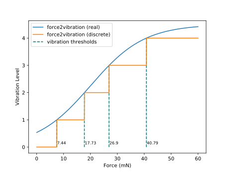

# haptic-glove-ros
Repository containing the code to communicate with the haptic-glove


Check repo [readme](https://github.com/samisnotinsane/arq-teleop-robot/tree/bura_de)


To use this repo:

- Install Arduino IDE 1.6.8 or newer;
- open the haptic_glove_driver sketch with it and go to File->Preferences;
- In `Additional Boards Manager URLs:` insert https://raw.githubusercontent.com/OpenHAK/Simblee/master/package_openhak_index.json;
- go to Tools->Board and select the `BoardManager`. Thus search for the `OpenHAK` boards; 
- go to Tools->Board and select the `OpenHAK` board;
- Attempt compilation with the `Verify` Button;
- In case of issues with the strings some of the libraries may need to be edited (related to the macro F)

- run the launch file `roslaunch haptic_glove_ros haptic_glove.launch dev_path:=/dev/ttyUSB0` specifing the USB port of the glove.

The Level of vibration is currently activated according to the following characteristic curve:



The curve is generated wih the following code:
```python
import numpy as np
import matplotlib.pyplot as plt

def logistic(x ,x0, k, L):
    det = 1 + np.exp( -k * (x - x0))
    return L / det

# x is the force applied 
# y is the vibration level
x = np.linspace(0, 60, 1500) 
y = int(np.floor(logistic(self.magnitude_filter[0][pin], 20, 0.1, 4.5))) # between 10- and 50-

plt.plot(x, y, label='force2vibration (real)')
plt.plot(x, np.floor(y), label='force2vibration (discrete)')
plt.vlines(
    x=x[:-1][(np.diff(np.floor(y))==1)].tolist(), 
    ymin=0.,
    ymax=[1, 2, 3, 4],
    colors='teal')
    linestyles='--',
    lw=1.5,
    label='vibration thresholds',

for i,th in enumerate(x[:-1][(np.diff(np.floor(y))==1)]):
    plt.text(x=th + 0.15, y=0.1, s=str(round(th, 2)), fontsize=8)

plt.xlabel('Force (mN)')
plt.ylabel('Vibration Level')
plt.legend(loc='upper left')
```

Another way is to run the serial node autonomously `rosrun rosserial_python serial_node.py /dev/ttyUSB0 _baud:=250000`. In many cases it gets problems if it is launched from launch file.
`roslaunch haptic_glove_ros haptic_glove.launch dev_path:=/dev/ttyUSB0 baud_rate:=250000` launches the application nodes that control the vibration using the optoforce topics.
